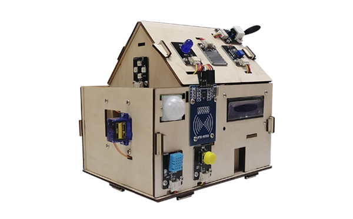
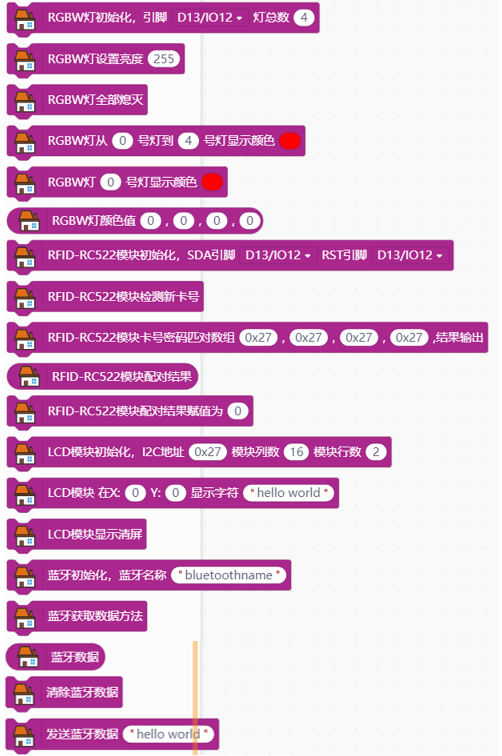
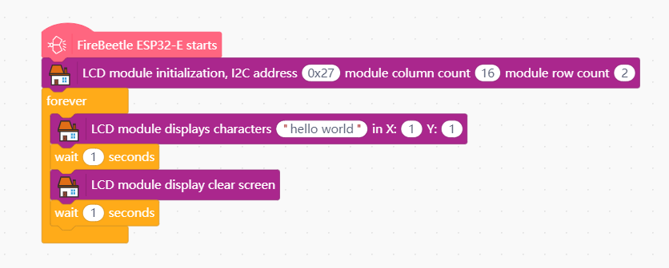

# BJDG-IOT House

---------------------------------------------------------

## Table of Contents

* [Summary](#summary)
* [Blocks](#blocks)
* [License](#license)
* [Supported targets](#Supportedtargets)

## Summary

This database is a supplementary function to the graphical programming of the Internet of Things hut for Baijia Dagu Maker products.
Support for the esp32-e motherboard's IIC communication LCD1602 screen, 6812RGBW lamp beads, rfid-rc522 RF module and classic Bluetooth communication.

## Blocks

## Examples

## License

MIT

## Supported targets

MCU                | JavaScript    | Arduino   | MicroPython    | Remarks
------------------ | :----------: | :----------: | :---------: | -----
ESP32-E        |             |       √       |             | 

## Release Logs
* V0.0.1  Basic functions completed.
